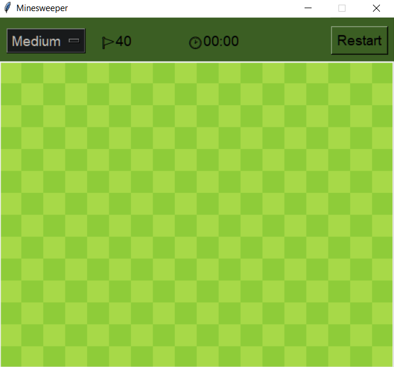

# Minesweeper in Python3, using tkinter. Interface imitiating google minesweeper.

  

## Board Generation:
- start generating bombs only after user clicks first cell
- no bombs around user's click
- add bomb count to cells around every bomb
 
## Gameplay:
- click on empty cell reveals all connected horizontally and verticaly empty cells
- click on number reveals it
- click on revealed cell -> do nothing
- right click not revealed cell - mark as bomb
- all non-bomb cells revealed -> win
- click on bomb -> lost game:
    - show all bombs 
    - show wrongly placed flags

## Interface:
- upper frame:
    - difficulty menu
    - counter of unmarked bombs
    - timer
    - restart button
- grid
- highlight hovered cells

##
Difficulty - Nr of bombs - Height - Width:
Easy            10           8        10
Medium          40          14        18
Hard            99          20        24

## Files:
- board.py - board, cells and everything about them
- game.py - interface
- setup.py - needed constants, function decorator for gating functions 